# 🛡️ AI-Powered Intrusion Detection System with Triage

*A Complete Machine Learning Security Analysis Platform — Data Preprocessing → Model Training → Explainability → MITRE Mapping → AI Triage → Dashboard*

---

<p align="center">
  
  
  
  
  
  
  
</p>

<p align="center">
  <b>Built by Ali Hamza</b>
</p>


> An end-to-end AI-powered Intrusion Detection System with SHAP explainability, MITRE ATT&CK mapping, and local LLM triage. Detects network attacks with **99.88% accuracy**.

---

## 📖 Table of Contents

- [🎯 Concept](#-concept)
- [⚡ Features](#-features)
- [🏗️ Architecture](#️-architecture)
- [🛠️ Tech Stack](#️-tech-stack)
- [📊 Model Performance](#-model-performance)
- [📸 Screenshots](#-screenshots)
- [🚀 Quick Start](#-quick-start)
- [📁 Project Structure](#-project-structure)
- [📄 License](#-license)
- [👥 Authors](#-authors)

---

## 🎯 Concept

This project was built to bridge the gap between three critical areas of cybersecurity and data science:

| Area | Description |
|------|-------------|
| 🤖 **Machine Learning** | Training Random Forest models on CICIDS2017 network flow data for attack detection |
| 🔍 **Explainable AI** | Using SHAP to understand why each prediction was made |
| 🔐 **Cybersecurity** | Mapping attacks to MITRE ATT&CK techniques and generating SOC-style triage summaries |

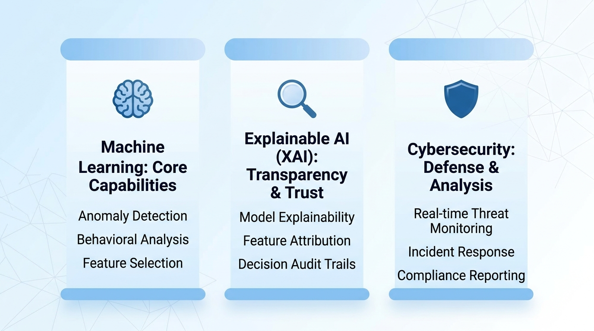

Rather than treating these as separate exercises, the project links them into a single pipeline: what the Random Forest model predicts becomes the input for SHAP explainability, which feeds into MITRE mapping, which triggers AI triage. Each component's output is the next component's input.

---

## ⚡ Features

| Feature | Description |
|---------|-------------|
| **Data Preprocessing** | Load, clean, and process 2.57M CICIDS2017 network flows |
| **Model Training** | Train Random Forest (99.88% accuracy) with SMOTE balancing |
| **SHAP Explainability** | Waterfall plots showing feature contributions for each prediction |
| **MITRE ATT&CK Mapping** | Map detected attacks to industry-standard technique IDs |
| **AI Triage** | Local Ollama + Llama 3.2 generates SOC-style summaries |
| **Streamlit Dashboard** | Interactive web interface with real-time analysis |
| **PDF Reports** | Professional security reports with AI-generated analysis |
| **Persistent Logging** | CSV export of all detection events |

### Key Statistics

| Metric | Value |
|--------|-------|
| Total Training Flows | 2.57 million |
| Total Test Flows | 514,000 (20% hold-out) |
| Features | 60 |
| Attack Types | 14 |
| Model Accuracy | 99.88% |
| Model F1 Score | 99.64% |
| Detection Time | < 0.1 seconds per flow |
| AI Triage Time | ~2–5 seconds per attack |

---

## 🏗️ Architecture

### System Architecture

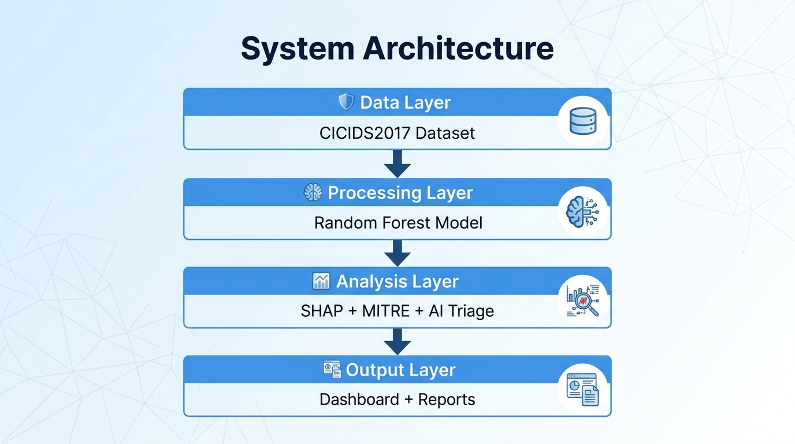

The system processes network flow data through a complete ML pipeline: data preprocessing → Random Forest prediction → SHAP explainability → MITRE mapping → AI triage → Dashboard & reporting.

### Analysis Pipeline

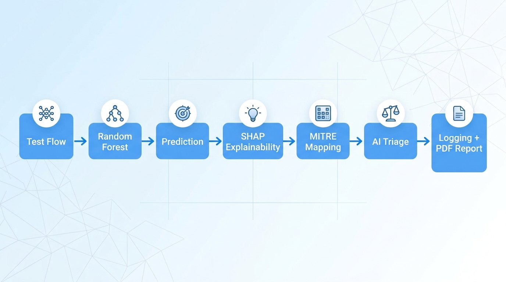

The pipeline flows from user input through prediction, explainability, MITRE mapping, and AI triage to final logging and reporting.

---

## 🛠️ Tech Stack

| Category | Technologies |
|----------|--------------|
| **Programming** | Python 3.14 |
| **Data Processing** | pandas, NumPy |
| **Machine Learning** | scikit-learn (Random Forest, Isolation Forest), PyTorch (Autoencoder) |
| **Explainability** | SHAP (TreeExplainer) |
| **Dashboard** | Streamlit |
| **AI Triage** | Ollama + Llama 3.2 (local) |
| **Reporting** | ReportLab, Matplotlib |
| **Version Control** | Git, GitHub |
| **Dataset** | CICIDS2017 (University of New Brunswick) |

---

## 📊 Model Performance

### Model Comparison

| Model | Accuracy | Precision | Recall | F1 Score | Time |
|-------|----------|-----------|--------|----------|------|
| **Random Forest** | **99.88%** | **99.40%** | **99.88%** | **99.64%** | 25.73s |
| Isolation Forest | 75.43% | 61.31% | 61.23% | 61.27% | 4.68s |
| Autoencoder | 73.14% | 98.73% | 15.55% | 26.90% | ~7 min |

### Best Model: Random Forest

- 5-fold Cross-Validation F1: 99.91% ± 0.02%
- Confusion Matrix: 513,884 True Positives, 102 False Negatives, 156 False Positives, 39,858 True Negatives

---

## 📸 Screenshots

### Dashboard Views

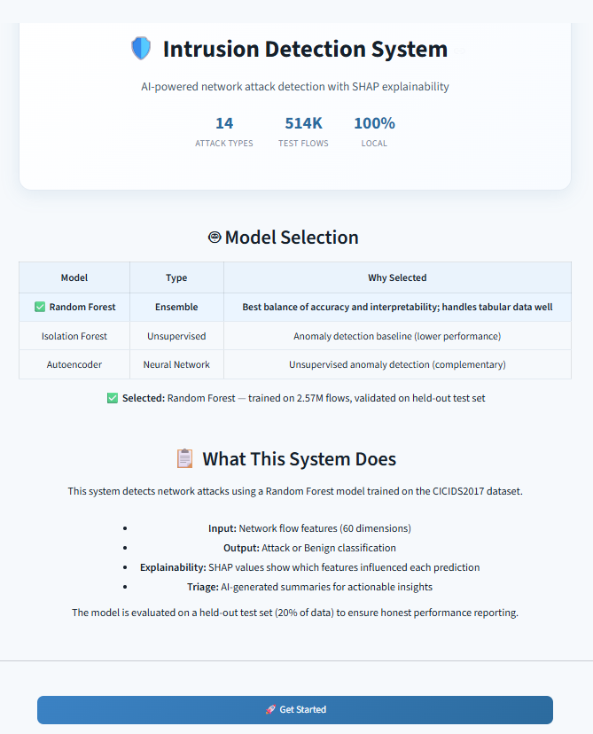
*Welcome page with project overview and model selection*

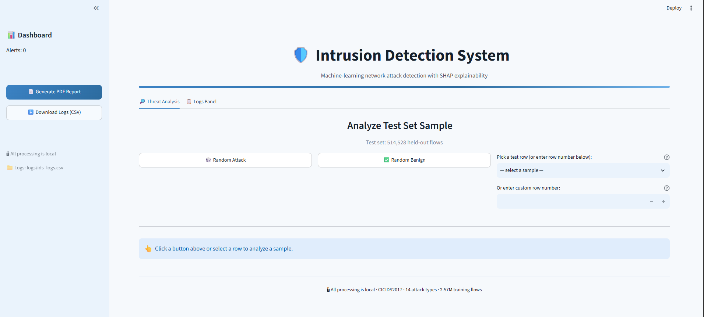
*Real-time attack detection with confidence scores*

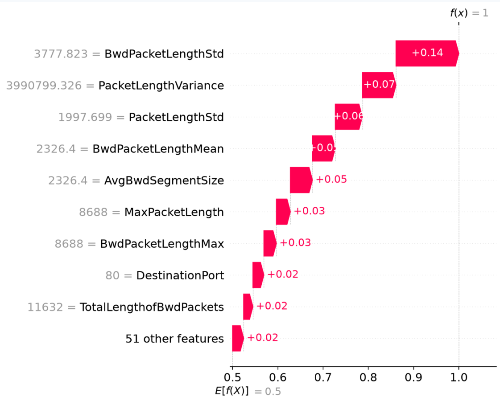
*SHAP explanation showing feature contributions*

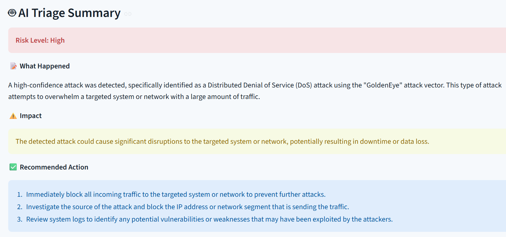
*AI-generated SOC-style triage summary*

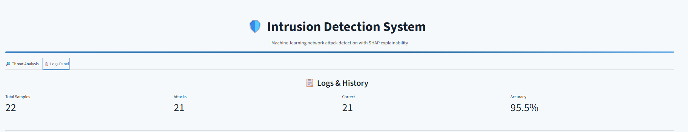
*Persistent logging with filters and statistics*

### SHAP Analysis

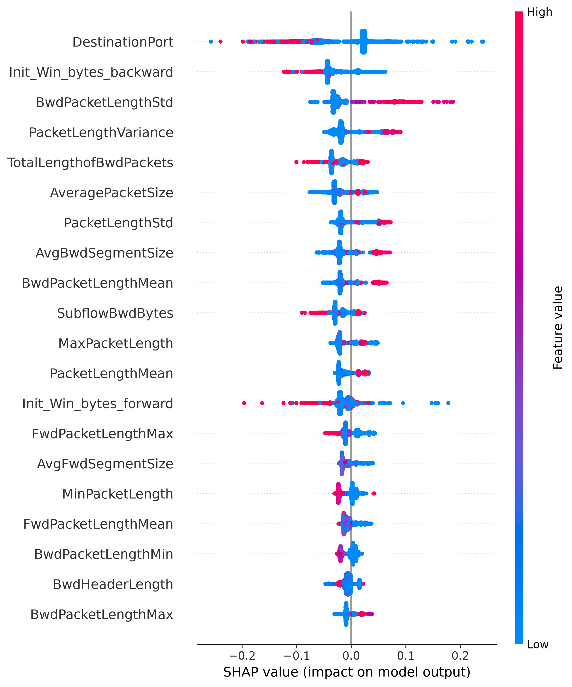
*Global feature importance from SHAP analysis*

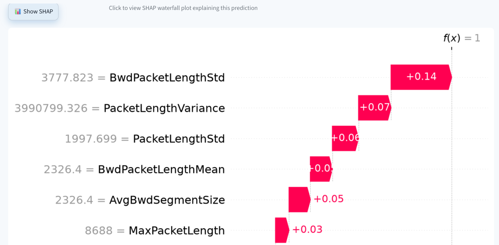
*Detailed waterfall plot for a specific attack*

### PDF Reports

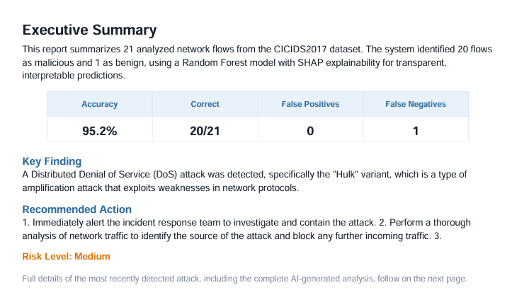
*Professional PDF report cover page*

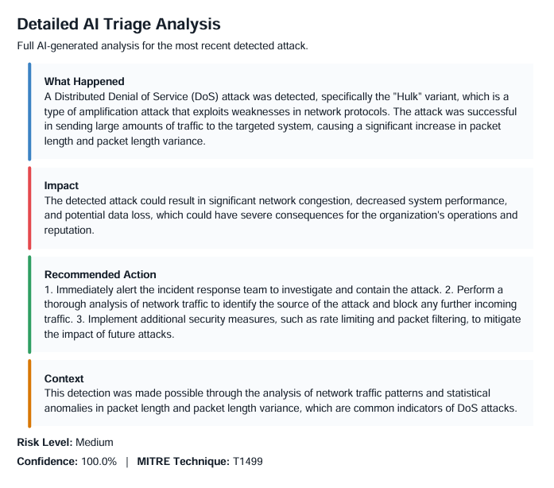
*Executive summary with key metrics*


*Detailed AI triage analysis in PDF*

---

## 🚀 Quick Start

### Prerequisites

```bash
# Clone the repository
git clone https://github.com/alix254742-ship-it/ai-ids-triage.git
cd ai-ids-triage

# Create and activate virtual environment
python -m venv venv
source venv/bin/activate  # Windows: venv\Scripts\activate
```

### Install Dependencies

```bash
pip install -r requirements.txt
```

### Install Ollama (for AI Triage)

```bash
# Download and install Ollama from: https://ollama.ai
# Then pull the Llama 3.2 model
ollama pull llama3.2
```

### Run Preprocessing

```bash
python src/preprocessing.py
```

### Train Models

```bash
python src/train_models.py
```

### Generate SHAP Explanations

```bash
python src/explainability.py
```

### Test AI Triage

```bash
python src/ai_triage.py
```

### Launch Dashboard

```bash
streamlit run src/dashboard.py
```

### Access the Dashboard

```text
Local URL: http://localhost:8501
Network URL: http://192.168.x.x:8501
```

### Generate PDF Report

1. Run the dashboard
2. Click **"📄 Generate PDF Report"** in the sidebar
3. Download the report

---

## 📁 Project Structure

```text
ai-ids-triage/
├── README.md
├── LICENSE
├── requirements.txt
├── .gitignore
│
├── src/
│   ├── preprocessing.py          # Data cleaning and preparation
│   ├── train_models.py           # Model training with SMOTE
│   ├── explainability.py         # SHAP analysis with progress bar
│   ├── mitre_mapping.py          # MITRE ATT&CK technique mapping
│   ├── ai_triage.py              # Ollama LLM triage integration
│   └── dashboard.py              # Full Streamlit dashboard
│
├── data/
│   └── processed/                # Processed dataset files
│       ├── X_processed_multiday.csv
│       ├── y_processed_multiday.csv
│       ├── attack_types_multiday.csv
│       └── test_indices.csv
│
├── models/                       # Trained models
│   ├── random_forest_multiday.pkl
│   ├── isolation_forest_multiday.pkl
│   ├── autoencoder_multiday.pth
│   ├── scaler_multiday.pkl
│   └── shap_feature_importance_multiday.csv
│
├── images/                       # Documentation screenshots
│   ├── hero-banner.jpg
│   ├── system-architecture.jpg
│   ├── three-pillars.jpg
│   ├── analysis-pipeline.jpg
│   ├── ids_welcome_screen.png
│   ├── dashboard_threat_analysis.png
│   ├── shap_waterfall_plot.png
│   ├── ai_triage_summary_card.png
│   ├── logs_and_history_panel.png
│   ├── shap_summary_plot_multiday.png
│   ├── shap_waterfall_detailed.png
│   ├── pdf_executive_summary.png
│   └── pdf_ai_triage_detailed.png
│
└── logs/                         # Persistent detection logs
    └── ids_logs.csv
```

---

## 📄 License

This project is licensed under the MIT License — see the [LICENSE](LICENSE) file for details.

---

## 👥 Authors

| Name | Role |
|------|------|
| Ali Hamza | Author |

---

## 🙏 Acknowledgments

- CIC (Canadian Institute for Cybersecurity) for the CICIDS2017 dataset
- MITRE Corporation for the ATT&CK framework
- The open-source community for the amazing tools and libraries

---

## ⚠️ Scope Statement

All analysis was performed on the CICIDS2017 dataset, an openly available network intrusion detection dataset from the University of New Brunswick. The system processes pre-processed flow features rather than raw PCAPs. All processing occurs locally; no data leaves the machine.

---

<p align="center"><b>Built with ❤️ for cybersecurity education and research</b></p>
<p align="center"><i>"Security is not a product, but a process." — Bruce Schneier</i></p>